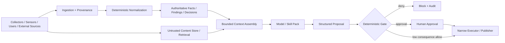

# Prompt Injection Threat Model

- **Status:** Documentation-only threat model
- **Objective:** Identify assets, actors, entry points, trust boundaries, attack paths, controls, and residual risk for prompt injection and agent hijacking.

## Assets to protect

- authoritative asset/evidence/classification/finding/decision records;
- tenant and site isolation;
- security and user data;
- provider/tool credentials;
- Skill Packs and policy/control artifacts;
- tool allowlists and schemas;
- RAG corpora and retrieval indexes;
- durable memory;
- model/provider routing configuration;
- saved dashboards, reports, policies, and workflows;
- publisher/action identities;
- audit and incident evidence.

## Threat actors

- remote attacker controlling content observed by OpenAssetWatch;
- malicious or compromised user;
- malicious content publisher or document author;
- compromised web/email/ticket/repository source;
- malicious or compromised tool/MCP server;
- compromised dependency or external AI service;
- malicious insider with content-placement access;
- another agent/model returning hostile or manipulated content.

## Entry points

### User-facing

- natural-language prompts;
- uploaded documents/files;
- pasted logs or advisories;
- dashboard labels/notes;
- investigation questions.

### Retrieved/external

- web pages/search results;
- email/ticket/comment content;
- repository files/issues/PR text;
- threat-intelligence feeds;
- CVE/advisory/vendor prose;
- external API responses;
- RAG documents/chunks;
- tool/MCP descriptions and responses.

### Security telemetry

- hostnames/FQDNs;
- DNS names;
- HTTP titles/banners;
- TLS certificate text;
- SNMP strings;
- DHCP names;
- mDNS/SSDP fields;
- software/firmware labels;
- SIEM/syslog message bodies;
- scanner output;
- IOC/malware-report descriptions.

### Multimodal

- screenshots and images;
- OCR text;
- QR codes;
- audio/transcripts;
- document images/metadata.

## Trust boundaries



The dangerous boundary is not simply "outside to inside." Authenticated observations may still contain attacker-controlled strings. Model-generated summaries may still be untrusted. Tool outputs may come from approved tools yet contain hostile instructions.

## Primary attack paths

### AP-01: Telemetry-to-tool hijack

```text
attacker-controlled hostname/banner
  -> authenticated observation
  -> model context
  -> interpreted as instruction
  -> tool proposal
  -> sensitive read or external write
```

**Required controls:** payload `instruction_authority=none`, bounded context, independent tool authorization, destination policy, sensitive-egress gate.

### AP-02: Poisoned advisory/RAG to durable memory

```text
malicious advisory/document
  -> RAG ingestion/retrieval
  -> model summary
  -> memory proposal
  -> persisted instruction
  -> future task hijack
```

**Required controls:** RAG provenance/quarantine, retrieval trust labels, memory-write gate, expiration, correction/retraction, no self-promotion.

### AP-03: MCP/tool description poisoning

```text
approved server changes description/schema
  -> model sees new hidden instruction
  -> requests broader parameter/data access
  -> external destination
```

**Required controls:** canonical tool identity, digest/schema pinning, drift review, response distrust, independent authorization.

### AP-04: Cross-agent propagation

```text
specialist reads hostile content
  -> summary/handoff embeds instruction
  -> coordinator/another specialist trusts peer output
  -> expanded task or tool request
```

**Required controls:** typed handoffs, trust preservation, coordinator-owned delegation, no trust-by-model-source, no same-model consensus as verification.

### AP-05: Output-to-renderer/executor injection

```text
model output contains active markup/query/code
  -> downstream renderer/executor trusts output
  -> XSS/query execution/code execution/data access
```

**Required controls:** strict schemas, safe rendering, no unrestricted generated SQL/code/shell, deterministic validators, bounded publisher/executor.

### AP-06: Data exfiltration through allowed channel

```text
untrusted content
  + private evidence access
  + external communication
  -> model encodes sensitive data in permitted output/tool request
```

**Required controls:** break capability triad, scoped read/write paths, DLP/output gate, human approval, destination allowlist, publisher separation.

### AP-07: Dashboard planner hijack

```text
hostile asset/finding/log text
  -> dashboard AI context
  -> model invents query/join/destination
  -> unauthorized data access or persistent dashboard change
```

**Required controls:** stable semantic metric IDs, approved panel catalog, schema-constrained plan, deterministic scope/cost/cardinality validator, temporary default, save approval.

### AP-08: Multimodal delayed injection

```text
image/audio/document metadata
  -> OCR/transcription/summary
  -> trust lost during transformation
  -> later RAG or agent context executes instruction
```

**Required controls:** provenance through transformations, derived content remains untrusted/model-generated, injection scan, memory/RAG write gate.

## Threat-to-control matrix

| Threat | Primary prevention/containment |
| --- | --- |
| Direct instruction override | context separation, bounded model, no model-owned authorization |
| Indirect injection | trust labels, quarantine, capability isolation, tool authorization |
| Obfuscation/multilingual | canonicalization + classifiers as signal; deterministic blast-radius controls remain primary |
| RAG poisoning | ingestion gate, provenance, tenant scope, retrieval trust labels |
| Memory poisoning | independent durable write gate, expiration, corrections |
| MCP/tool poisoning | identity/digest/schema review, response distrust, authz gateway |
| Multi-agent propagation | typed handoffs, no automatic trust, coordinator-owned scope |
| Exfiltration | capability triad separation, DLP/output gate, destination policy |
| System-prompt leakage | minimize secrets in prompts, output validation, no prompt-secret-as-control assumption |
| Output injection | strict schemas, safe renderers, separate publishers/executors |
| Cross-tenant leakage | deterministic scope at retrieval/tool/output layers |
| Dashboard injection | approved catalog + schema plan + deterministic validator |

## Residual risk

Residual risk is deliberately non-zero. Attackers can adapt language, encoding, timing, context, or multimodal delivery. Classifiers and prompt formatting can reduce attack success but cannot justify broad privilege.

The safety target is therefore:

```text
Even when model reasoning is manipulated,
critical platform invariants still hold.
```

## Security invariants under model compromise

Assume the model follows a malicious instruction. The system must still prevent it from:

- reading another tenant without authorization;
- obtaining raw credentials;
- adding tools or changing tool schemas;
- widening task/resource scope;
- directly writing authoritative facts/findings/decisions;
- persisting unreviewed durable memory;
- publishing restricted data externally;
- executing unrestricted code/query/shell;
- bypassing required human approval;
- changing deterministic rules/policy;
- saving/modifying persistent dashboards without authorization.

## Detection signals

Useful signals include:

- attempts to override or reveal higher-priority instructions;
- hidden/encoded/obfuscated instruction-bearing text;
- content that requests tools/actions inconsistent with the user's objective;
- requests to widen scope or destination;
- suspicious tool-description/schema drift;
- retrieved chunks that request persistence or external communication;
- repeated/adaptive attempts after refusal/block;
- multi-agent handoffs that relabel recommendations as instructions/facts;
- model output with unexpected URLs, encodings, active markup, or query/code fields.

Signals support triage; they do not substitute for authorization.

## Privacy and forensic boundary

Prompt-injection investigations SHOULD retain IDs, digests, scope, source, rule/detector version, decisions, and bounded excerpts. Full sensitive prompts/documents should be retained only under explicit forensic need and access controls.

## Review triggers

Revisit this threat model when:

- a new action-capable tool is added;
- external processing or new provider mode is enabled;
- RAG/durable memory becomes active;
- MCP/tool-server support is introduced;
- multi-agent delegation becomes active;
- adaptive dashboard generation is implemented;
- a material injection incident or novel attack class is discovered.