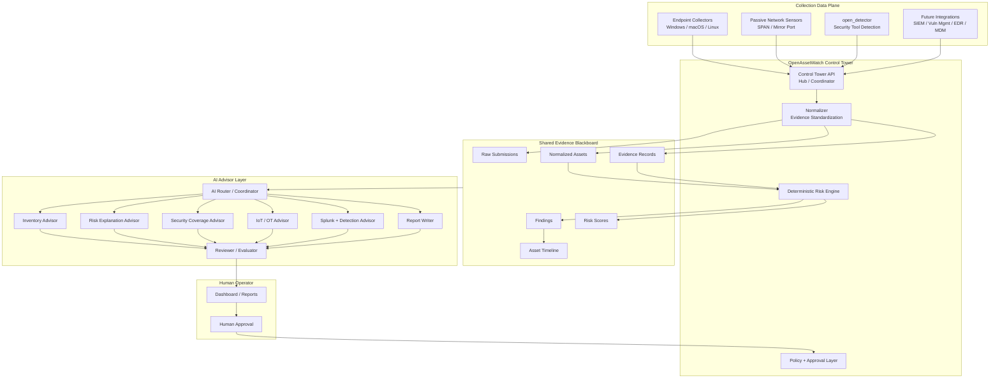

# OpenAssetWatch AI Advisor Architecture

## Purpose

The OpenAssetWatch AI Advisor helps users understand asset inventory, network
observations, software and security tooling coverage, enrichment data, and risk
findings.

The AI Advisor should provide value after OpenAssetWatch has collected,
normalized, enriched, and scored data. It should not replace collector logic,
normalization, deterministic detection rules, or rule-based risk scoring.
Instead, it should explain what OpenAssetWatch already knows, highlight gaps,
prioritize next steps, and produce evidence-backed summaries and reports.

This document defines the official AI Advisor architecture direction for
OpenAssetWatch. It is architecture planning only; it does not implement AI
runtime code, MCP servers, database tables, collector behavior, or remediation
workflows.

## Why this architecture

OpenAssetWatch needs AI that can scale from family and lab deployments to SMB
environments without becoming an uncontrolled agent swarm. The AI Advisor
should help users understand assets, risk, coverage gaps, segmentation ideas,
reports, and detection logic while keeping deterministic OpenAssetWatch data
and rules authoritative.

The architecture must support:

- endpoint collectors, passive network sensors, integrations, and
  `open_detector` as independent collection spokes
- a Control Tower hub that normalizes evidence, coordinates policy, and
  exposes operator workflows
- a shared evidence layer that keeps raw submissions, normalized assets,
  observations, findings, timelines, and scores auditable
- AI modules that read evidence and findings but do not invent facts
- reviewer/evaluator checks before AI output is surfaced to users
- read-only defaults, tenant boundaries, privacy controls, and audit trails
- local/offline operation first, with future optional BYOK provider support

## Official architecture pattern

The official AI architecture pattern is:

```text
Hierarchical Hub-and-Spoke + Shared Evidence Blackboard
```

Control Tower is the hub and coordinator. Endpoint collectors, passive network
sensors, integrations, `open_detector`, MCP-style tools, and AI modules are
spokes. Raw submissions and normalized evidence flow into the shared Asset
Intelligence Store / Evidence Blackboard. AI Advisor modules read from that
blackboard and produce evidence-linked explanations, recommendations, reports,
and detection ideas.

Deterministic rules, normalization, and risk scoring remain the source of
truth. AI may explain, summarize, prioritize, and recommend, but it must not
replace repeatable detection logic or present unsupported assumptions as facts.

## Visual architecture artifact

A docs-friendly visual artifact for this architecture is available at:

- `docs/architecture/assets/openassetwatch-ai-advisor-architecture.svg`
- `docs/architecture/assets/openassetwatch-ai-advisor-architecture.html`

The visual companion page is
`docs/architecture/ai-advisor-architecture.md`.

## High-level system diagram



## Component responsibilities

- Control Tower API: acts as the hub/coordinator for ingestion, normalized
  asset views, finding retrieval, advisor requests, policy checks, and future
  approval flows.
- Endpoint collectors: submit host inventory, software, platform, local
  identity, collector status, and security tooling evidence.
- Passive network sensors: submit passive observations, neighbor data, service
  clues, network placement evidence, and future asset communication context.
- `open_detector`: identifies security tooling and coverage evidence without
  turning AI into the source of truth for installed tools.
- Integrations: contribute future enrichment from SIEM, vulnerability,
  endpoint, identity, MDM, CMDB, and ticketing systems.
- Normalizer: converts raw submissions into stable OpenAssetWatch assets,
  observations, evidence records, and source references.
- Deterministic risk engine: creates repeatable findings, scores, and rule
  results from normalized evidence.
- Shared Evidence Blackboard: stores the current evidence context AI is allowed
  to read and cite. It is the source of truth for AI-readable evidence context.
- AI Router / Coordinator: selects the appropriate read-only AI module for an
  advisory task and constrains the evidence window.
- Reviewer / Evaluator: checks AI output for missing evidence, hallucination,
  unsafe recommendations, tenant leakage, prompt-injection exposure, and audit
  readiness before the result reaches the UI.
- Policy + Approval Layer: enforces read-only defaults today and would gate any
  future high-impact action with explicit policy and human approval.

## Data flow

1. Collectors, passive sensors, `open_detector`, and integrations submit raw
   evidence to Control Tower.
2. Control Tower normalizes submissions into assets, observations, evidence
   records, detector results, timelines, findings, and risk scores.
3. Deterministic rules and scoring create repeatable findings from normalized
   evidence.
4. AI Advisor requests are routed through the AI Router / Coordinator with a
   scoped evidence set from the Shared Evidence Blackboard.
5. Specialist advisor modules produce draft summaries, explanations,
   recommendations, reports, or detection ideas.
6. The Reviewer / Evaluator checks the draft for evidence support, safety,
   tenant boundaries, prompt-injection exposure, and audit metadata.
7. Approved advisory output is shown in the dashboard, report surface, or
   future export path with links back to evidence records and findings.
8. Any future action request must stop at the Policy + Approval Layer until a
   human approves a scoped workflow.

## Shared Evidence Blackboard

The Shared Evidence Blackboard is the normalized evidence surface AI may use.
It is the source of truth for AI-readable evidence context. It is not a
separate truth engine and does not make AI authoritative over deterministic
rules, findings, or risk scores. It is the auditable context window for advisor
work.

The blackboard should include:

- raw submission references
- normalized assets
- evidence records
- detector results
- network observations
- software and security tooling coverage
- findings
- risk scores
- asset timelines
- enrichment references
- tenant, site, deployment, collector, and source identifiers

AI output must link back to records on the blackboard whenever practical. If
evidence is stale, incomplete, low confidence, or conflicting, the AI Advisor
should say so and avoid presenting the answer as settled fact.

The blackboard should also protect safety boundaries:

- no cross-tenant evidence access
- no secrets or sensitive raw payloads in generated output
- untrusted collector, integration, and user-supplied text treated as data, not
  instructions
- deterministic findings and scores preserved as source-of-truth inputs

## AI Advisor modules

The AI Advisor layer is hierarchical. A router/coordinator receives user or
workflow requests, chooses the narrowest useful module, and passes only the
tenant-scoped evidence needed for that task.

Initial modules should include:

- Inventory Advisor for unmanaged, unknown, duplicate, stale, or changing
  assets.
- Risk Explanation Advisor for explaining deterministic findings, evidence,
  severity, and practical priority.
- Security Coverage Advisor for missing EDR, MDM, vulnerability, logging, or
  other security tooling coverage.
- IoT / OT Advisor for likely embedded, appliance, printer, camera, OT-like,
  and special-purpose devices.
- Splunk + Detection Advisor for Splunk searches, dashboard ideas, CIM mapping
  notes, and detection logic suggestions.
- Report Writer for executive summaries, technical reports, remediation plans,
  and recurring review notes.
- Reviewer / Evaluator for evidence, safety, privacy, prompt-injection, and
  audit checks across all advisor outputs.

## User Value

The AI Advisor should eventually help users answer questions such as:

- What devices are on my network?
- Which assets look unmanaged?
- Which devices expose risky services?
- Which hosts are missing EDR, MDM, logging, or vulnerability agents?
- Which devices look like IoT, OT-like, embedded, printers, cameras, or
  appliances?
- Which assets changed recently?
- Which devices should be segmented?
- What should I fix first?
- Why is this asset risky?
- Generate an executive summary.
- Generate a technical remediation report.
- Suggest Splunk searches or dashboard ideas.

These answers should be grounded in OpenAssetWatch evidence rather than broad
model guesses. The AI should help users move from raw visibility to clear,
prioritized action.

## Advisory-First Principle

The AI Advisor is advisory first.

The AI may:

- explain
- summarize
- prioritize
- recommend
- generate reports
- suggest validation steps

The AI must not automatically:

- change firewall rules
- modify endpoints
- change collector configuration
- run active scans
- start packet capture
- execute shell commands
- exploit systems
- collect credentials

Any future workflow that could affect systems, networks, collectors, or users
must require explicit human approval and must pass through narrowly scoped
safety controls.

## Evidence-First Principle

Every AI Advisor answer should be grounded in OpenAssetWatch evidence.
Relevant evidence may include:

- asset records
- network observations
- collector metadata
- software and security tooling detections
- vulnerability enrichment
- CMDB or identity enrichment
- policy and capability context
- timestamps
- source references

AI output should include evidence references wherever practical, such as asset
IDs, collector IDs, observation timestamps, software detection evidence,
finding IDs, source systems, and confidence levels. When evidence is weak,
missing, or indirect, the AI should say so plainly.

## AI Evidence and Finding Schema

### Evidence-First Requirement

Every AI finding must be tied back to OpenAssetWatch evidence. The AI Advisor
must not invent evidence or present unsupported assumptions as facts.

Evidence may come from:

- asset records
- network observations
- collector metadata
- software and security tooling detections
- vulnerability enrichment
- CMDB enrichment
- identity enrichment
- policy and capability context
- timestamps
- source system references

When evidence is incomplete, stale, indirect, or low confidence, the AI Advisor
should say so clearly in the finding output.

### Evidence Card Schema

An evidence card is a normalized reference to a source record that supports an
AI finding.

Suggested fields:

- `evidence_id`
- `evidence_type`
- `source`
- `source_record_id`
- `asset_id`
- `collector_id`
- `observed_at`
- `confidence`
- `summary`
- `raw_reference`

Example evidence types:

- `asset`
- `network_observation`
- `software_detection`
- `vulnerability`
- `identity`
- `cmdb`
- `policy`
- `collector_status`
- `capability`

`raw_reference` should point back to the OpenAssetWatch record or source system
reference needed for auditability. It should not expose secrets, credentials,
private keys, tokens, or sensitive raw data in AI-generated reports.

### AI Finding Schema

An AI finding is an advisory output generated from one or more evidence cards.

Suggested fields:

- `finding_id`
- `title`
- `summary`
- `severity`
- `confidence`
- `affected_assets`
- `evidence`
- `reasoning_summary`
- `recommended_action`
- `safe_validation_steps`
- `business_impact`
- `technical_details`
- `framework_mappings`
- `created_at`
- `agent_name`
- `model_provider`
- `model_name`

Severity values:

- `informational`
- `low`
- `medium`
- `high`
- `critical`

Confidence may use either:

- `low`
- `medium`
- `high`

or a numeric score from `0.0` to `1.0`.

Confidence must reflect evidence quality, not only model certainty. A model may
sound confident while the evidence is weak; in that case, finding confidence
should remain low or medium.

### Reasoning Summary

The AI Advisor should provide a short reasoning summary, not private
chain-of-thought.

The reasoning summary should explain:

- what evidence was used
- why it matters
- why the recommendation was made

This summary should be concise, auditable, and suitable for reports. It should
not expose hidden prompts, private deliberation, sensitive raw data, or secrets.

### Framework Mappings

AI findings may optionally include framework mappings when the mapping is
supported by the evidence and useful for reporting.

Potential mappings include:

- CIS Controls
- NIST CSF
- NIST SP 800-207 Zero Trust
- MITRE ATT&CK, where appropriate
- OWASP AISVS for AI system security
- OWASP Top 10 for LLM/Agentic Applications, where appropriate

Mappings should be advisory and evidence-backed. The AI should not add
framework references merely to make a finding look more severe.

### Example Finding

```json
{
  "finding_id": "ai-finding-example-unmanaged-device",
  "title": "Unmanaged device observed on network",
  "summary": "A device was observed through network neighbor discovery but has no matching security tooling, identity, or CMDB enrichment.",
  "severity": "medium",
  "confidence": "medium",
  "affected_assets": ["asset-123"],
  "evidence": [
    {
      "evidence_id": "evidence-network-observation-456",
      "evidence_type": "network_observation",
      "source": "collector_network_neighbors",
      "source_record_id": "456",
      "asset_id": "asset-123",
      "collector_id": "collector-home-lab-01",
      "observed_at": "2026-06-12T05:00:00Z",
      "confidence": "medium",
      "summary": "The asset was observed through ARP/neighbor discovery.",
      "raw_reference": "network_observations/456"
    }
  ],
  "reasoning_summary": "The asset has network observation evidence but no matching software detection, identity enrichment, or CMDB enrichment records. This suggests ownership and management status should be validated before treating it as trusted.",
  "recommended_action": "Validate device ownership, confirm expected network placement, and determine whether security tooling or segmentation is required.",
  "safe_validation_steps": [
    "Confirm whether the IP and MAC address are expected on this network.",
    "Check whether the device has an owner or inventory record.",
    "Review whether the device belongs on the current network segment."
  ],
  "business_impact": "Unmanaged devices may increase blind spots and make incident response harder.",
  "technical_details": "The finding is based on network neighbor discovery and absence of matching management enrichment records.",
  "framework_mappings": [],
  "created_at": "2026-06-12T05:05:00Z",
  "agent_name": "ai_advisor_asset_posture",
  "model_provider": "not_implemented",
  "model_name": "not_implemented"
}
```

### Safety Notes

- AI must not invent evidence.
- AI must clearly say when evidence is incomplete.
- AI must not claim exploitation or compromise without supporting evidence.
- AI must separate observed facts from recommendations.
- AI must avoid exposing secrets or sensitive raw data in reports.

## Safety and trust boundaries

The AI Advisor should treat OpenAssetWatch as a visibility and decision-support
platform, not as an autonomous remediation system. Safety and policy controls
must sit between AI reasoning and any future tool use.

Core trust boundaries:

- Control Tower owns ingestion, normalization, policy, identity, and audit
  decisions.
- The deterministic risk engine owns repeatable findings and scores.
- The Shared Evidence Blackboard owns the evidence context available to AI.
- AI modules are advisory readers and writers of reviewed advisory output.
- The Reviewer / Evaluator checks AI output before it reaches users.
- The Policy + Approval Layer blocks any future high-impact action until a
  scoped human approval workflow exists.

The AI Advisor should follow these safety principles:

- read-only by default
- no arbitrary remote commands
- tenant isolation
- secrets redaction
- tool allowlists
- capability checks
- license and entitlement checks in the future
- human approval for high-impact actions
- audit logging for AI decisions and tool use

## Prompt-injection and untrusted-data handling

Collector data, network observations, hostnames, banners, package names,
software names, user notes, integration output, and MCP tool output are
untrusted inputs. The AI Advisor must treat them as evidence data, not as
instructions.

Prompt-injection controls should include:

- separate system, policy, and developer instructions from retrieved evidence
- quote or structure untrusted evidence so it cannot override policy
- ignore instructions embedded in hostnames, banners, package names, notes, or
  tool responses
- constrain retrieval to tenant-scoped evidence records
- require evidence IDs for claims and recommendations
- run Reviewer / Evaluator checks for instruction-following attempts,
  unsupported claims, unsafe recommendations, and tenant leakage
- log rejected or suspicious prompt-injection attempts where practical

The AI Advisor should never follow instructions that originate from collected
asset data, network traffic metadata, external integrations, or tool output
unless the instruction is also present in trusted OpenAssetWatch policy.

## Tenant and privacy boundaries

Tenant, site, deployment, collector, asset, and source identifiers are part of
the evidence contract. AI requests must be scoped to the authorized tenant or
self-hosted deployment context before evidence is retrieved.

Privacy boundaries:

- no cross-tenant evidence, memory, findings, prompts, or generated output
- redact secrets, credentials, tokens, private keys, hashes, and sensitive raw
  payloads
- minimize evidence sent to any external provider
- keep local/offline processing available for privacy-focused deployments
- include tenant and evidence identifiers in audit records
- ensure report output does not expose unrelated tenant, asset, or user data

For hosted or managed deployments, tenant ownership must come from
server-side identity, enrollment, authorization, and policy context. The AI
Advisor must not trust user-supplied `tenant_id` values by themselves.

## Auditability and explainability

Every AI action should produce an audit trail sufficient to answer what was
asked, what evidence was used, what model or provider produced the output, how
the output was reviewed, and what the user did next.

Audit records should capture:

- request ID
- actor or workflow
- tenant, site, deployment, and asset scope
- advisor module name
- evidence IDs and finding IDs used
- model provider, model name, and runtime mode, if applicable
- output summary or output reference
- confidence
- Reviewer / Evaluator result
- policy decision and approval ID, if applicable
- user action, dismissal, export, or report delivery event
- timestamps

Explainability should use concise reasoning summaries rather than hidden
chain-of-thought. AI output should separate observed facts, deterministic
findings, evidence gaps, recommendations, confidence, and safe validation
steps.

## Local/offline LLM and BYOK future support

OpenAssetWatch should support local/offline AI first where practical. Families,
labs, home networks, and privacy-focused SMBs should be able to keep asset and
risk evidence inside their own environment.

Future provider support should be pluggable and policy-controlled:

- local/offline model runtime for privacy-first deployments
- self-hosted model runtime on a dedicated AI/MCP node
- hosted OpenAssetWatch-managed model runtime for managed deployments
- optional bring-your-own-key external LLM support

External or BYOK providers must be disabled by default unless a deployment
explicitly enables them. Sensitive evidence should be redacted, minimized, and
scoped before external use. Provider selection must be auditable and visible in
AI output metadata.

## MCP integration model

MCP-style integrations are future spokes in the Hub-and-Spoke architecture.
They may expose evidence review, enrichment, reporting, export, or detection
support capabilities, but they must not bypass Control Tower policy.

The integration model is:

```text
AI module -> AI Tool Gateway -> Policy + Approval Layer -> approved MCP tool
```

MCP tools should be treated as untrusted until reviewed and enabled. Tool
descriptions, tool output, and external server metadata must not become policy.
MCP tool use must be routed through the same gateway controls as native
OpenAssetWatch tools: allowlists, input validation, output validation, tenant
scope, audit logging, and approval where required.

## What AI is allowed to do

By default, the AI Advisor may:

- read normalized evidence it is authorized to access
- explain deterministic findings and risk scores
- summarize asset inventory and recent changes
- identify unmanaged, unknown, stale, duplicate, or suspicious assets
- identify likely security tooling coverage gaps
- recommend safe segmentation review steps
- suggest safe validation steps
- generate executive and technical reports
- suggest Splunk searches, dashboard ideas, CIM mapping notes, and detection
  logic
- produce evidence-linked recommendations and confidence levels
- ask for human approval when a future workflow requires it

Allowed AI output must remain advisory, evidence-grounded, tenant-scoped,
auditable, and clear about uncertainty.

## What AI is not allowed to do

By default, the AI Advisor must not:

- execute shell commands
- run active scans
- start packet capture
- exploit systems
- collect credentials, password hashes, tokens, or private keys
- modify endpoints
- change collector configuration or packages
- change firewall, router, VLAN, segmentation, identity, cloud, or MDM policy
- isolate devices
- remediate findings automatically
- notify external parties or create external tickets without policy approval
- send sensitive evidence to external providers without explicit configuration
  and minimization
- access cross-tenant evidence, memory, findings, prompts, or output
- treat AI output as the source of truth over deterministic evidence and rules

Any future workflow that could affect systems, networks, collectors, users, or
external parties must require an explicit policy, a scoped human approval
workflow, audit logging, and safe stop or rollback conditions.

## AI Tool Gateway and MCP Safety Model

### Purpose

The AI Tool Gateway is the controlled layer between AI agents and OpenAssetWatch
tools, APIs, integrations, and future MCP-style servers.

The gateway should make tool use:

- controlled
- auditable
- policy-aware
- tenant-isolated
- safe by default

AI agents should not call backend APIs, collector actions, external
integrations, or MCP-style tools directly. They should request tool use through
the gateway so OpenAssetWatch can enforce policy, capability, license, tenant,
approval, and audit controls consistently.

### Tool Categories

Initial tool categories may include:

- read-only inventory tools
- read-only asset search tools
- read-only network observation tools
- read-only finding/risk tools
- report generation tools
- enrichment lookup tools
- policy explanation tools
- future controlled action tools

### Default Safety Rule

All tools are read-only by default unless explicitly marked otherwise.

Any tool that could change systems, modify collector behavior, send sensitive
data outside a tenant, trigger network activity, or notify external parties
must be treated as higher risk and require explicit metadata, policy checks,
and human approval where appropriate.

### Disallowed by Default

AI agents must not be allowed to perform these by default:

- arbitrary shell commands
- unrestricted Nmap
- mass scanning
- packet capture
- exploit execution
- credential dumping
- password, hash, or token collection
- firewall changes
- endpoint changes
- collector updates
- destructive actions
- cross-tenant access

These activities must remain unavailable unless a future feature explicitly
implements a safe, scoped, policy-controlled workflow. Some actions, such as
exploit execution or credential dumping, should remain outside the
OpenAssetWatch AI Advisor design entirely.

### Tool Metadata

Future tools should declare metadata before they can be enabled.

Suggested fields:

- `tool_name`
- `tool_description`
- `tool_category`
- `read_only`
- `requires_approval`
- `required_capability`
- `required_license`
- `allowed_roles`
- `tenant_scoped`
- `input_schema`
- `output_schema`
- `risk_level`
- `audit_enabled`

Tool metadata should be reviewed before enablement. The gateway should not rely
only on natural-language tool descriptions for safety decisions.

### Human Approval

Future high-impact actions require human approval, including:

- active scan
- SNMP query
- packet capture
- firewall or segmentation change
- collector policy update
- collector package update
- ticket creation that notifies others
- external enrichment that sends sensitive data outside the tenant

Approval should be explicit, scoped, time-bound where practical, and logged.
The approving user should see what action is requested, which assets or tenants
are affected, what evidence supports the action, and what rollback or stop
conditions exist.

### Safety Checks

Before tool execution, the gateway should perform these checks:

- tenant isolation
- user authorization
- collector capability check
- license or entitlement check
- tool allowlist check
- input validation
- output validation
- rate limit check
- audit logging
- approval check when required

If any required check fails, the tool call should be denied and the AI Advisor
should explain the denial without attempting a workaround.

### MCP-Style Integrations

MCP-style integrations may be supported later, but they must go through the
same gateway controls as native OpenAssetWatch tools.

Safety notes:

- do not trust external MCP server descriptions blindly
- scan and review tools before enabling
- disable unknown or high-risk tools by default
- prevent tool poisoning
- prevent prompt injection through tool output
- log tool calls and outputs where appropriate

External tool output should be treated as untrusted input. The AI Advisor
should not follow instructions embedded in tool output unless those
instructions come from a trusted OpenAssetWatch policy context.

### Agent Behavior Rules

All agents must:

- request tools through the gateway
- use least privilege
- prefer read-only evidence gathering
- explain what tool was used
- cite or reference evidence returned by tools
- stop if approval is required
- never bypass policy, capability, or license checks

The gateway should make the safe path the normal path. Agents that cannot
complete a task within available permissions should report what is missing
rather than escalating themselves.

## AI Specialist Agent Roles

The AI Advisor may use specialist agents to keep analysis focused, auditable,
and safer than one broad general-purpose agent. These agents are conceptual
roles for future design. They are not implemented in this PR.

### Shared Rules for All Agents

All AI specialist agents must:

- use OpenAssetWatch evidence
- not invent findings
- separate observed facts from recommendations
- include confidence
- include safe validation steps
- not execute changes
- not run arbitrary commands
- respect tenant isolation and policy/capability limits

### Asset Intelligence Agent

Purpose:

Identify unmanaged, duplicate, stale, unknown, or suspicious assets.

Example outputs:

- unmanaged asset list
- stale collector/device list
- duplicate asset candidates
- unknown device summary

### Network Behavior Agent

Purpose:

Review network observations, neighbor data, protocol clues, and asset
communication patterns.

Example outputs:

- newly observed assets
- unexpected network neighbors
- unusual network placement
- network activity summaries

### Exposure and Risk Agent

Purpose:

Identify risky combinations, exposed services, missing controls, and
prioritization.

Example outputs:

- risky asset summary
- missing control findings
- prioritized remediation list
- exposure explanation

### Segmentation Advisor

Purpose:

Recommend safe segmentation groups based on asset type, observed behavior,
business role, and risk.

Example outputs:

- suggested network zones
- assets that should be isolated
- segmentation rationale
- validation steps before changing network policy

### IoT and OT Advisor

Purpose:

Flag likely embedded, IoT, OT-like, printer, camera, appliance, unmanaged, or
special-purpose devices.

Example outputs:

- likely IoT/OT asset list
- confidence level
- evidence used
- recommended validation steps

### Security Tooling Advisor

Purpose:

Review EDR, MDM, vulnerability agent, logging, and security tooling coverage.

Example outputs:

- assets missing EDR
- assets missing vulnerability agents
- assets missing MDM
- coverage gaps by platform or site

### Remediation Planner

Purpose:

Turn findings into safe, step-by-step remediation plans.

Important: this agent recommends actions but does not execute them.

Example outputs:

- remediation checklist
- owner/action mapping
- validation steps
- rollback considerations

### Report Writer

Purpose:

Generate executive summaries, technical reports, asset review notes, and
remediation plans.

Example outputs:

- executive summary
- technical remediation report
- weekly asset risk report
- customer-facing assessment summary

### Detection and Splunk Advisor

Purpose:

Suggest Splunk searches, CIM mapping ideas, dashboard ideas, and detection
logic based on OpenAssetWatch evidence.

Example outputs:

- Splunk search suggestions
- dashboard ideas
- CIM mapping notes
- detection engineering recommendations

### Reviewer / Evaluator

Purpose:

Review AI outputs before they are shown to users or written to an audit trail.

Checks should include:

- every factual claim links to evidence
- recommendations stay within policy
- uncertainty is clear
- tenant boundaries are preserved
- prompt-injection attempts are ignored
- unsafe actions are blocked or routed to approval
- report output avoids secrets and sensitive raw data

### Data Quality Agent

Purpose:

Find bad data, missing fields, stale collectors, duplicate assets, invalid MACs,
inconsistent hostnames, and normalization issues.

Example outputs:

- data quality report
- stale collector list
- invalid asset records
- normalization improvement recommendations

## AI Memory, Audit, and Agent Handoff Model

### Purpose

AI memory helps OpenAssetWatch agents remember prior findings, user feedback,
remediation history, report history, and agent handoffs.

Memory must not replace the OpenAssetWatch database as the source of truth.
The database should remain authoritative for assets, collectors, observations,
findings, enrichment records, policies, and audit records. AI memory should
summarize context, preserve useful continuity, and link back to source evidence.

Core rule:

```text
AI memory is tenant-scoped, evidence-linked, auditable, and advisory.
```

### Memory Scopes

Memory scopes may include:

- tenant memory
- deployment memory
- collector memory
- asset memory
- finding memory
- agent session memory
- global product/safety memory

Tenant or customer memory must never cross tenant/customer boundaries. Global
product/safety memory may describe general OpenAssetWatch behavior, safety
rules, documentation patterns, or product guidance, but it must not include
tenant-specific observations, asset details, or customer data.

### Memory Types

- asset memory: Stores useful historical context about an asset, such as prior
  identity decisions, owner feedback, or recurring observations.
- finding memory: Stores context about previous AI or rule-based findings,
  including whether they were accepted, rejected, resolved, or superseded.
- remediation memory: Stores remediation history, validation outcomes, owner
  notes, and rollback considerations.
- report memory: Stores generated report history, audience notes, recurring
  summary patterns, and prior delivery context.
- user feedback memory: Stores user corrections, confirmations, dismissals,
  and preferences that should shape future advisory output.
- agent handoff memory: Stores concise handoff notes from one specialist agent
  to another.
- policy/safety memory: Stores applicable safety constraints, policy decisions,
  approval requirements, and known local operating limits.

### Evidence-Linked Memory

Memory records should link back to evidence whenever possible.

Suggested reference fields:

- `asset_id`
- `collector_id`
- `finding_id`
- `network_observation_id`
- `source_record_id`
- `observed_at`
- `created_at`
- `updated_at`

Memory should summarize context, but keep references back to the original
evidence so users and future agents can audit why a memory exists. When current
evidence conflicts with older memory, current evidence should take precedence
and the stale memory should be marked accordingly.

### Agent Handoff

Agents may create handoff notes for other agents when a finding needs a
specialized follow-up.

Example:

The Asset Intelligence Agent finds an unmanaged device. It creates a handoff
for:

- Exposure and Risk Agent
- Segmentation Advisor
- Report Writer

Handoff records should include:

- `source_agent`
- `target_agent`
- `summary`
- `related_assets`
- `related_findings`
- `evidence_refs`
- `recommended_next_step`
- `created_at`

Handoff notes should be concise, evidence-linked, and scoped to the tenant or
deployment where the work originated. They should not contain secrets or
unsupported claims.

### Audit Model

Memory writes and AI tool use should be auditable.

Audit records should include:

- `actor`
- `agent_name`
- `action`
- `memory_type`
- `tenant_id`
- `related_asset_id`
- `related_finding_id`
- `created_at`
- `model_provider`
- `model_name`
- `approval_id`, if applicable

Audit records should make it possible to answer who or what wrote memory, which
agent used it, what evidence was referenced, and whether approval was required
for the action.

### Memory Safety

AI memory must follow these safety rules:

- no cross-tenant memory access
- no secrets in memory
- no credentials, tokens, hashes, or private keys
- sensitive fields should be redacted
- memory should clearly indicate stale or old information
- user feedback can correct or override AI assumptions
- high-impact recommendations must still cite current evidence
- memory poisoning must be treated as a threat
- memory writes should be policy-controlled and audited

Memory should be treated as helpful context, not truth by itself. AI agents
should verify important claims against current OpenAssetWatch evidence before
making high-impact recommendations.

### Storage Direction

Future storage options may include:

- Postgres tables for structured memory
- pgvector or vector search for semantic retrieval
- local/self-hosted memory mode
- managed Control Plane memory mode
- JSON/YAML-style export for transparency

The first implementation should prefer simple, auditable storage over opaque
memory behavior. Users should be able to inspect, export, and delete memory
records according to tenant policy.

## Future roadmap

### Phase 1: Architecture and Schemas

Phase 1 defines the foundation before any AI runtime is introduced.

- official Hub-and-Spoke + Shared Evidence Blackboard architecture
- AI Advisor foundation
- evidence/finding schema
- Reviewer / Evaluator contract
- specialist agent roles
- Tool Gateway safety model
- memory/audit/handoff model
- report templates

### Phase 2: Read-Only AI Advisor MVP

Phase 2 should introduce the first usable AI Advisor experience with read-only
behavior.

- read-only AI Advisor API
- model/provider abstraction
- local model option
- prompt templates
- evidence-grounded finding summaries
- deterministic report generation
- no tool execution beyond read-only queries

### Phase 3: Specialist Agents

Phase 3 should add focused specialist agents that operate on OpenAssetWatch
evidence.

- Asset Intelligence Agent
- Network Behavior Agent
- Exposure and Risk Agent
- Segmentation Advisor
- IoT and OT Advisor
- Security Tooling Advisor
- Remediation Planner
- Report Writer
- Detection and Splunk Advisor
- Data Quality Agent

### Phase 4: Tool Gateway and Integrations

Phase 4 should add the controlled gateway layer for safe tool access and
integration-specific advisory workflows.

- policy-aware tool allowlist
- tenant-scoped tools
- audit logging
- approval records
- MCP-style adapter support
- Splunk advisor integration
- vulnerability enrichment advisor
- CMDB/identity enrichment advisor

### Phase 5: Controlled Actions with Approval

Phase 5 may add tightly scoped, human-approved actions. These actions should
remain constrained by policy, capability, tenant, license, and audit controls.

- active scans only with approval
- SNMP queries only with approval
- ticket creation only with approval when it notifies others
- collector policy changes only with approval
- no arbitrary commands
- no exploit execution
- no destructive actions

### Phase 6: Enterprise Readiness

Phase 6 should prepare the AI Advisor for managed, enterprise, or SaaS-style
deployments.

- tenant controls
- model/provider allowlists
- external data sharing policies
- memory retention controls
- agent evaluation
- prompt/tool security scanning
- red-team testing
- compliance mapping

### Roadmap Safety Notes

- AI remains advisory first.
- Read-only comes before controlled actions.
- Controlled actions require approval.
- Evidence must be cited or referenced.
- Tenant isolation is mandatory.
- Memory must remain evidence-linked and auditable.

## Implementation checklist

Before implementing AI Advisor runtime behavior, OpenAssetWatch should have:

- canonical evidence records with stable IDs and source references
- normalized assets, observations, detector results, findings, timelines, and
  risk scores available through read-only APIs
- tenant, site, deployment, collector, asset, and source identity boundaries
- deterministic risk scoring that remains authoritative
- read-only advisor request and response contracts
- evidence-linked AI finding and report schemas
- Reviewer / Evaluator checks for evidence support, safety, privacy, tenant
  leakage, prompt-injection exposure, and output quality
- audit records for requests, evidence IDs, model/provider metadata, reviewer
  results, confidence, approvals, and user actions
- model/provider configuration with local/offline defaults and BYOK controls
- MCP/tool gateway metadata, allowlists, input validation, output validation,
  and policy checks before any tool is enabled
- explicit human approval workflow before any future high-impact action
- tests or evaluation fixtures that prove AI output refuses unsupported claims
  and cites evidence

## Out of Scope

The following are out of scope for this PR:

- memory database tables
- vector database
- AI runtime implementation
- model or provider integration
- MCP server implementation
- tool runtime implementation
- approval workflow implementation
- cross-agent orchestration code
- autonomous scanning
- automated actions
- exploit tools
- packet capture
- credential collection
- active network changes
