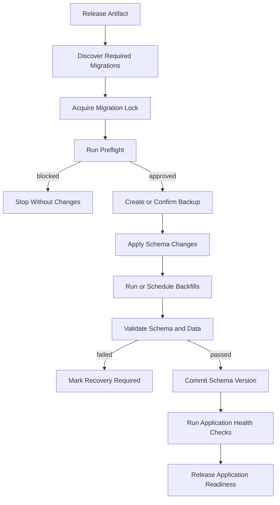

# Database Schema Migration Governance

## Purpose

This document defines the OpenAssetWatch lifecycle for changing the canonical database schema safely across local, self-hosted, distributed, and air-gapped deployments.

The current project now has a project-native versioned baseline. As deployments persist across releases, the remaining governance in this document guides historical upgrade coverage, backfills, backup and recovery, and rolling compatibility.

This document is provider-neutral. It does not require a specific migration framework or database vendor. It defines the behavior that any chosen implementation must provide.

## Architecture Status

- Architecture state: `implemented_baseline`
- Runtime impact: migration 0001 is applied and verified before API readiness
- Canonical implementation: `backend/app/schema_migrations.py` and `backend/app/migration_sql/`
- Operator guide: `docs/DATABASE_MIGRATIONS.md`
- Deferred: historical upgrades, large backfills, automated restore, rolling mixed-version support, and dedicated migration credentials

---

## 1. Core Principles

1. Schema changes are versioned code changes.
2. Migration history is stored in source control.
3. A fresh installation and an upgraded installation must converge on the same supported schema.
4. Application startup must not silently invent production schema changes.
5. Destructive changes require explicit review, backup, and recovery planning.
6. Data migrations are distinct from schema migrations.
7. Expand-and-contract changes are preferred over breaking in-place changes.
8. Migration state is durable and queryable.
9. Concurrent application instances must not run the same migration independently.
10. Failed migrations produce an unsafe-to-start state rather than a partially compatible application.
11. Air-gapped deployments receive complete offline migration artifacts.
12. Rollback claims must be honest about irreversible data transformation.

---

## 2. Schema Sources of Truth

OpenAssetWatch should maintain three related artifacts:

### 2.1 Canonical Schema Model

The application-level definition of tables, columns, relationships, indexes, constraints, and data types.

### 2.2 Versioned Migration History

An ordered history describing how one supported schema version becomes the next.

### 2.3 Bootstrap Schema

A fresh-install path that produces the current supported schema.

The bootstrap schema must not diverge from the result of applying the full migration history. Automated tests should verify convergence.

### Source-of-Truth Rule

The canonical model defines the intended current state. The migration history defines how existing deployments reach that state. Neither should be maintained independently without a consistency check.

---

## 3. Migration Categories

### 3.1 Additive Schema Migration

Examples:

- add nullable column
- add new table
- add non-unique index
- add new enum value where safely supported
- add optional relationship

Usually lower risk, but still requires versioning and tests.

### 3.2 Constraint Migration

Examples:

- add non-null requirement
- add unique constraint
- add foreign key
- tighten allowed values
- change validation rules

Requires preflight checks proving existing data satisfies the new constraint.

### 3.3 Data Backfill

Examples:

- populate a new canonical identifier
- derive tenant scope for historical records
- compute content hashes
- normalize old status values
- migrate embedded data into a new table

Backfills should be resumable, bounded, observable, and independent from application request handling.

### 3.4 Index Migration

Examples:

- add or rebuild index
- change index strategy
- add tenant-scoped composite index

Large index changes should avoid long blocking operations where deployment size makes that relevant.

### 3.5 Transforming Migration

Examples:

- change column type
- split one field into several
- merge fields
- convert serialized data into normalized records
- change identifier format

Requires explicit compatibility and rollback analysis.

### 3.6 Destructive Migration

Examples:

- drop column
- drop table
- delete or rewrite historical records
- remove supported status values
- make old application versions incompatible

Requires heightened review, backup confirmation, deprecation notice, and a completed expand-and-contract sequence where practical.

---

## 4. Schema Version Record

Every database should expose a durable schema state record.

Suggested fields:

- current schema version
- last successful migration identifier
- migration batch identifier
- migration applied time
- application release that applied it
- migration checksum
- dirty or failed state
- minimum compatible application version
- maximum compatible application version, when required
- last preflight result
- last backup reference

Example:

```json
{
  "schema_version": "12",
  "last_migration_id": "0012_add_evidence_digest",
  "migration_batch_id": "release-0.6.0",
  "applied_at": "",
  "application_release": "0.6.0",
  "migration_checksum": "sha256:",
  "state": "clean",
  "minimum_compatible_application": "0.6.0"
}
```

Suggested states:

- `uninitialized`
- `clean`
- `migration_required`
- `migrating`
- `failed`
- `recovery_required`
- `unsupported_newer_schema`
- `unsupported_older_schema`

---

## 5. Migration File Contract

Each migration should declare:

- migration identifier
- parent migration identifier
- description
- author or owner
- creation date
- schema version before and after
- upgrade operations
- downgrade operations, when safe
- data backfill requirement
- expected lock behavior
- estimated risk class
- online or maintenance-window classification
- minimum application compatibility
- affected tables and indexes
- backup requirement
- validation query or check
- checksum

Example metadata:

```yaml
migration_id: 0012_add_evidence_digest
parent: 0011_add_evidence_bundle
risk_class: low
online_safe: true
backup_required: false
affected_objects:
  - evidence_items
validation:
  - all new rows accept a digest
  - existing rows remain readable
downgrade_supported: true
```

---

## 6. Expand-and-Contract Strategy

Breaking changes should normally use multiple releases.

```text
Release A — Expand
- add new field or table
- support old and new forms
- begin dual write when necessary

Release B — Migrate
- backfill historical data
- verify parity
- switch reads to new form

Release C — Contract
- stop writing old form
- retain compatibility window
- remove old field only after validation
```

### Required Rules

- contract does not begin until backfill completes
- parity is measured before switching reads
- old data remains recoverable during the compatibility window
- dual write has conflict and failure handling
- a rollback target remains available until the old path is removed

---

## 7. Application Compatibility

### 7.1 Startup Check

Before serving traffic, the application should compare:

- application-supported schema range
- current database schema version
- dirty migration state
- required migration checksums

Possible outcomes:

- start normally
- start in read-only maintenance mode
- refuse startup and request migration
- refuse startup because the database is newer than the application
- refuse startup because migration recovery is required

### 7.2 Multiple Application Versions

Rolling deployments require a defined compatibility window.

During that window:

- old and new application versions may run together only if the schema supports both
- new writes must remain readable by both versions where required
- contract migrations wait until old instances are gone
- task workers follow the same compatibility policy as API instances

### 7.3 Worker Compatibility

Background workers should record:

- worker version
- supported schema range
- task schema version

A worker must not lease work requiring an unsupported schema.

---

## 8. Migration Locking and Coordination

Only one migration coordinator should apply a migration batch.

Required controls:

- database-level or equivalent distributed lock
- lock owner identity
- lock acquisition time
- lock expiration or recovery procedure
- migration heartbeat for long operations
- stale-lock review
- no automatic parallel migrators

Application instances waiting on migration should remain unready rather than racing to alter schema.

---

## 9. Preflight Validation

Before applying a migration, validate:

- current schema version matches the expected parent
- migration checksum is valid
- database connectivity and permissions
- sufficient storage capacity
- required extensions or features
- no unresolved prior failure
- data satisfies future constraints
- backup requirement is met
- migration lock is available
- application compatibility plan
- expected migration duration and operational mode

### Preflight Result

Suggested fields:

- migration batch
- timestamp
- database identifier
- current version
- target version
- checks performed
- warnings
- blockers
- estimated work
- backup reference
- approved by

A blocker must stop migration before any operation is applied.

---

## 10. Backup and Restore

### 10.1 Backup Requirement

A backup is required before:

- destructive changes
- irreversible data transformations
- large backfills without proven replay
- identifier rewrites
- retention-policy transitions that delete data
- major database version changes

### 10.2 Backup Record

Record:

- backup identifier
- database identifier
- schema version
- migration batch
- created time
- storage location reference
- encryption status
- integrity digest
- restore test status
- retention expiration

### 10.3 Restore Testing

A backup should not be considered valid solely because creation succeeded. Restore testing should verify:

- backup integrity
- schema version
- representative row counts
- foreign-key consistency
- critical application queries
- tenant isolation
- artifact and database reference consistency

### 10.4 Recovery Boundary

A database restore may not reverse:

- external notifications
- external ticket changes
- exposed credentials
- network calls
- artifacts written after the backup

Recovery procedures must identify these non-database side effects.

---

## 11. Data Backfill Architecture

Large backfills should run as Platform Task Orchestrator jobs rather than one unbounded startup transaction.

### Backfill Record

- backfill identifier
- migration identifier
- tenant or global scope
- cursor or checkpoint
- processed count
- remaining estimate
- error count
- last successful checkpoint
- state
- started and completed time

Suggested states:

- pending
- running
- paused
- partially_completed
- completed
- failed
- cancelled

### Backfill Rules

- bounded batch size
- resumable cursor
- deterministic transformation
- idempotent update
- rate and load limits
- tenant-aware ordering where relevant
- visible progress
- validation after completion
- no silent skipped records

A schema migration may mark a feature unavailable until its required backfill completes.

---

## 12. Migration Execution Flow



### Atomicity

Where the database supports transactional schema changes safely, related operations may run in one transaction. Where it does not, the migration must track each step and define recovery behavior.

---

## 13. Failure and Recovery

### 13.1 Failure Record

Record:

- migration identifier
- failed operation
- error class
- error summary
- time
- lock owner
- schema state
- completed steps
- backup reference
- recovery instructions

### 13.2 Dirty State

A failed partial migration should set the database to `failed` or `recovery_required`.

The application should not assume the parent or target schema is usable until recovery validates it.

### 13.3 Recovery Options

- retry the failed idempotent step
- run a documented repair migration
- restore from backup
- complete the remaining forward migration
- enter read-only mode for export or inspection

### 13.4 Downgrade

Downgrade is supported only when:

- the migration declares a safe inverse
- no incompatible data was created
- no information would be silently lost
- application compatibility permits it

Otherwise, recovery should use a forward repair or backup restore rather than pretending downgrade is safe.

---

## 14. New Installation Bootstrap

A new deployment should:

1. create an empty database
2. establish the migration tracking table
3. apply the supported migration path or validated current bootstrap
4. verify bootstrap and migration-history convergence
5. create required indexes and constraints
6. run health and security checks
7. seed only explicitly approved system metadata

Demo data must remain opt-in, synthetic, and separate from production bootstrap.

---

## 15. Air-Gapped Migration Support

An offline release bundle should include:

- migration files
- migration checksums
- required runtime code
- compatibility metadata
- preflight command
- dry-run or plan output
- backup instructions
- upgrade instructions
- recovery instructions
- validation command

Migration execution must not require external package downloads, online schema services, or hidden callbacks.

---

## 16. Multi-Tenant Considerations

Schema is normally shared while data remains tenant-scoped.

Migration tests should verify:

- tenant identifiers remain populated
- row-level or application-level tenant controls remain effective
- new tables include required tenant scope
- indexes support tenant-first queries where appropriate
- backfills do not copy data across tenants
- uniqueness constraints include tenant boundaries when required
- deletion and retention remain tenant-safe

A migration that introduces ambiguous tenant ownership should fail preflight or quarantine affected records.

---

## 17. Artifact and Search Consistency

Schema migrations may affect external artifact references and derived search indexes.

Required behavior:

- canonical database migration completes first
- artifact reference transformations are explicit
- derived indexes may be rebuilt
- index version is tied to schema and mapping version
- index lag and rebuild state are visible
- failed indexing does not roll back canonical schema
- deleted or reclassified data propagates to derived stores

---

## 18. Security Requirements

- migration files are code-reviewed
- migration checksums are verified
- migration execution uses a narrow administrative identity
- normal application identities cannot alter migration history
- backups are encrypted and access-controlled when sensitive
- logs redact credentials and secret values
- dynamic migration downloads are prohibited
- migration state cannot be rewritten silently
- destructive migrations require explicit approval
- production migration output is retained according to audit policy

---

## 19. Testing Requirements

### 19.1 Unit Tests

- migration metadata validation
- version ordering
- checksum validation
- compatibility range logic
- upgrade and downgrade behavior where supported

### 19.2 Fresh Install Test

Create a new empty database and confirm the application reaches current schema.

### 19.3 Upgrade Matrix

Test upgrades from each supported prior release to the target release.

### 19.4 Bootstrap Convergence

Compare a fresh bootstrap schema with a database upgraded through migration history.

### 19.5 Failure Injection

Test:

- lock contention
- disk exhaustion
- interrupted migration
- failed backfill
- invalid checksum
- incompatible application version
- restore from backup

### 19.6 Tenant Isolation Regression

Run representative cross-tenant negative tests after migrations affecting tenant-scoped tables.

### 19.7 Performance Test

For large tables, test migration duration, locking behavior, and backfill load against a representative dataset.

---

## 20. Release Workflow

Before release:

- identify schema changes
- generate or review migration files
- update compatibility metadata
- run fresh-install test
- run supported upgrade tests
- run tenant-isolation tests
- classify backup requirement
- document expected duration
- document recovery path
- include migration files in offline artifacts

During deployment:

- pause or drain incompatible workers
- acquire migration lock
- run preflight
- confirm backup
- apply migrations
- run backfills or mark them pending
- validate
- start compatible application instances
- monitor errors and lag

After deployment:

- confirm schema state is clean
- confirm worker compatibility
- confirm critical queries
- confirm tenant isolation
- confirm search and artifact consistency
- retain migration logs and backup according to policy

---

## 21. Operational Visibility

Expose:

- current schema version
- target schema version
- migration required state
- last migration result
- pending backfills
- failed records
- backup readiness
- compatibility warning
- migration lock state
- search rebuild state

These details should be administrator-only and must not reveal credentials or sensitive row contents.

---

## 22. Implementation Roadmap

### Phase A — Migration Contract

- completed: project-native migration runner compatible with the current backend
- completed: checksummed migration tracking and compatibility metadata
- completed: immutable ordered migrations stored in source control

### Phase B — Current Schema Baseline

- completed: current supported schema captured as migration 0001
- completed: fresh and compatible-existing database convergence tests
- completed: existing tables, constraints, and legacy owners documented
- completed: regression gate prevents silent ordinary-module DDL changes

### Phase C — Release Gates

- completed for the baseline: fresh-install and existing-schema adoption tests
- completed: migration checksum validation and fail-closed history checks
- completed: startup compatibility and readiness checks
- completed: bounded operator status, verify, and migrate commands
- remaining: multi-release upgrade fixtures once post-baseline migrations exist

### Phase D — Backfill Integration

- move large data transforms behind Platform Task records
- add checkpoints and progress
- add partial and failure states

### Phase E — Production Hardening

- completed: stable PostgreSQL advisory locking with bounded acquisition
- add backup confirmation
- add restore tests
- add air-gapped migration bundle validation
- add rolling compatibility tests

---

## 23. Acceptance Criteria

Migration governance should not be considered production-capable until:

- schema history is source-controlled
- the current schema version is queryable
- a fresh install and upgraded install converge
- application startup checks compatibility
- only one migration coordinator can run
- destructive changes require backup and explicit review
- large backfills are resumable and observable
- failed migrations produce a recovery-required state
- rollback claims are limited to genuinely reversible changes
- supported prior releases pass upgrade tests
- tenant isolation is retested after relevant schema changes
- air-gapped upgrades require no external access
- migration logs and checksums are retained

---

## 24. Explicit Non-Goals

This architecture does not require:

- replacing the current database immediately
- adopting a particular migration framework by name
- running migrations automatically on every application process
- supporting downgrade for every change
- retaining compatibility with every historical release indefinitely
- using production data in migration fixtures
- allowing AI to generate or execute migrations without human review
- downloading migration code at runtime
- silently repairing unknown schema drift

## Final Position

OpenAssetWatch should move from first-run schema initialization to versioned migration governance before persistent production upgrades become common.

The essential requirements are not tied to one tool: source-controlled history, compatibility checks, locking, preflight validation, expand-and-contract changes, resumable backfills, backup and recovery, air-gapped support, and visible failure states.

A schema failure must never be mistaken for a healthy application state.
