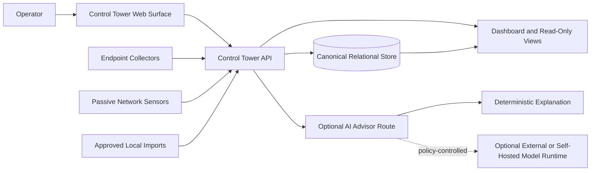
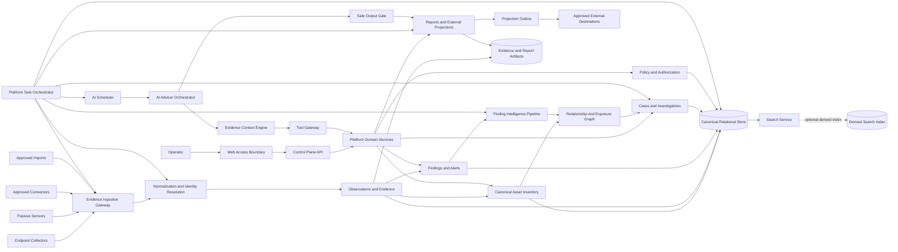

# OpenAssetWatch Platform Architecture Overview

## Purpose

This document is the top-level architecture map for OpenAssetWatch. It explains how the current Control Tower, collectors, sensors, evidence pipeline, defensive intelligence, integrations, background work, and optional AI capabilities fit together.

It provides both:

- a **current-state view** that reflects the existing early Control Tower implementation
- a **target-state view** that organizes the documented future architecture without committing every component to a separate service

This document uses OpenAssetWatch terminology only. It does not reproduce an external platform design, product diagram, vendor-specific workflow, or third-party implementation.

## Architecture Status

- Architecture state: `documented_direction`
- Runtime impact: none
- Implementation authorization: none
- Current project posture: passive-first, evidence-first, advisory-first, and read-only by default

The target-state sections describe interfaces and trust boundaries. They do not require an immediate rewrite of the current application.

---

## 1. Architectural Principles

OpenAssetWatch should remain:

1. **Passive-first** — asset and environment visibility should come primarily from endpoint inventory, passive sensors, approved imports, and read-only enrichment.
2. **Evidence-first** — every important finding, relationship, and recommendation should point to current evidence.
3. **Deterministic-first** — collection, normalization, canonical identity, baseline findings, authorization, and policy enforcement remain deterministic.
4. **Advisory-first** — AI and future playbooks may explain and recommend, but they do not silently change systems.
5. **Local-first** — the core platform remains useful with external processing disabled.
6. **Tenant-scoped** — every record, request, task, tool call, and output is scoped before processing.
7. **Provider-neutral** — interfaces describe capabilities rather than depending on one external service or runtime.
8. **Fail-visible** — missing coverage, failed enrichment, stale evidence, and degraded isolation must be shown explicitly.
9. **Replaceable** — search, queues, model runtimes, connectors, and external projections remain replaceable behind stable contracts.
10. **Auditable** — important changes, analysis steps, approvals, publications, and failures produce structured records.

---

## 2. Current-State Architecture

The current Control Tower is intentionally small. It already establishes several important boundaries:

- a local operator-facing web surface
- a Control Tower API
- a relational database
- collector and sensor submission paths
- normalized asset records
- evidence persistence
- health and freshness summaries
- deterministic and optional AI Advisor routes
- read-only AI evidence tools
- local demo and development support

### 2.1 Current-State Diagram



### 2.2 Current Logical Responsibilities

The current backend provides or begins to provide:

- sites and deployment scope
- collector and sensor enrollment metadata
- collector check-ins
- local endpoint inventory ingestion
- passive observation ingestion
- raw evidence persistence
- canonical asset normalization
- asset, collector, and site freshness
- basic dashboard aggregation
- AI Advisor task execution
- bounded read-only evidence retrieval
- audit metadata for AI requests

### 2.3 Current Limitations

The current state does not yet provide the complete target architecture for:

- a formal Web Access Boundary
- a general Platform Task Orchestrator
- versioned schema migration governance
- a dedicated case and investigation lifecycle
- a connector runtime with checkpoints and circuit breakers
- a canonical relationship graph
- an optional derived search service
- a durable outbox for external projections
- queue-backed long-running work
- full coverage accounting across analyzers
- complete AI component, permission-path, and output governance

These are documented future directions, not defects requiring an immediate platform rewrite.

---

## 3. Target-State Architecture

### 3.1 Target-State Diagram



### 3.2 Important Boundary

The diagram shows **logical components**, not a mandatory microservice count. Several components may initially remain modules inside the current backend. A component should become a separate service only when scaling, isolation, ownership, availability, or deployment needs justify the split.

---

## 4. Major Platform Domains

### 4.1 Web Access Boundary

The Web Access Boundary is the operator-facing security boundary between browser clients and internal platform services.

Responsibilities should include:

- secure browser session handling
- same-origin API access where practical
- trusted-origin enforcement
- request-size limits
- request correlation identifiers
- browser-safe error normalization
- response security headers
- cross-site request protections
- frontend asset delivery
- optional API version translation
- prevention of browser access to internal service credentials

The current web surface may continue to call the Control Tower API directly during local development. A future same-origin gateway or backend-for-frontend should be adopted only when it closes a concrete security or deployment gap.

### 4.2 Control Plane API

The Control Plane API is the primary authenticated application boundary.

Responsibilities include:

- request authentication
- role and tenant authorization
- API versioning
- canonical domain operations
- read-only and write capability separation
- task submission
- policy decisions
- audit metadata
- consistent validation and error contracts
- safe pagination and filtering

It must not expose direct database credentials, raw internal queues, unrestricted tool execution, or model credentials to browser clients.

### 4.3 Sites, Tenants, and Environments

This domain establishes operational scope.

Suggested objects:

- tenant
- deployment
- site
- environment
- network segment
- collector group
- sensor group
- business service
- ownership boundary

These records should anchor authorization, inventory, evidence, tasks, findings, and reports.

### 4.4 Collectors and Sensors

Collectors and sensors provide evidence; they do not become privileged sources of unquestioned truth.

Responsibilities include:

- enrollment
- identity and version metadata
- check-ins
- capability reporting
- passive observations
- local inventory
- health and freshness
- submission authentication
- bounded batch delivery
- replay and idempotency

Collectors should not automatically receive remote command, package installation, self-update, credential collection, or general AI execution capability.

### 4.5 Canonical Asset Inventory

The Canonical Asset Inventory is the authoritative normalized view of discovered assets.

It may contain:

- asset identity
- aliases
- addresses
- device class
- platform and software
- ownership
- management state
- collector and sensor coverage
- site and segment relationships
- first and last seen
- evidence references
- confidence and conflict state
- freshness

The inventory should remain canonical in the relational store. Search indexes, reports, AI contexts, and external systems are derived views.

### 4.6 Observations and Evidence

Observations describe what a source reported. Evidence packages selected, normalized, and attributable observations for review.

Required properties include:

- source identity
- tenant and site scope
- observed and received timestamps
- schema version
- content digest
- raw record reference
- normalization status
- trust classification
- freshness
- evidence quality
- data classification

Evidence should remain immutable or append-oriented where practical. Corrections should preserve the earlier record and create a superseding relationship.

### 4.7 Findings and Alerts

A finding is a canonical condition supported by evidence. An alert is an operational notification that a condition requires attention.

A finding may exist without an alert. An alert may summarize one or more findings. Alerts should not replace the underlying finding or evidence.

Responsibilities include:

- canonical finding creation
- severity and confidence separation
- validation state
- finding fusion
- alert thresholds
- alert routing
- deduplication
- suppression and visibility policy
- stale-state handling

### 4.8 Cases and Investigations

A case is an operational container for related alerts, findings, assets, evidence, analyst activity, AI assessments, playbook runs, approvals, and reports.

Responsibilities include:

- deterministic case formation
- assignment and atomic claiming
- status and verdict lifecycle
- service targets
- timeline and ledger
- evidence and relationship pivots
- analyst assessment
- optional AI assessment
- report generation
- closure and reopening
- external projection references

### 4.9 Relationship and Exposure Graph

The graph represents relationships derived from canonical platform records.

Possible node types:

- asset
- identity
- service
- software
- vulnerability
- segment
- finding
- control
- collector
- case
- external exposure
- business service

Every edge should identify whether it is observed, deterministically derived, corroborated, inferred, or hypothesized.

The graph may support:

- exposure-path analysis
- control-break recommendations
- blast-radius review
- asset pivots
- permission-path analysis
- AI activity relationships
- root-cause clustering

The graph is a relationship view over canonical records, not a replacement for them.

### 4.10 Connectors and Integrations

Connectors import approved evidence or project selected canonical state outward.

Responsibilities include:

- self-describing capabilities
- tenant-scoped instances
- credential references
- polling or webhook intake
- checkpoints
- health and circuit state
- source preservation
- normalization profiles
- schema-drift detection
- rate and concurrency limits
- idempotent external projection

An integration cannot silently become the authority for OpenAssetWatch assets, findings, cases, approvals, or policy.

### 4.11 Platform Task Orchestrator

The Platform Task Orchestrator coordinates non-interactive platform work such as:

- connector polling
- evidence normalization
- enrichment refresh
- stale-evidence review
- collector-health evaluation
- finding recalculation
- case correlation
- scheduled reports
- retention and cleanup
- projection retries
- coverage checks
- AI job scheduling

It is broader than the AI Scheduler. Its detailed contract is defined in `platform-task-orchestration.md`.

### 4.12 AI Advisor and Tool Gateway

The AI Advisor is an optional advisory layer over approved evidence.

Its responsibilities include:

- typed task classification
- policy-aware model routing
- evidence-context selection
- specialist-agent coordination
- structured output validation
- uncertainty reporting
- evidence citation
- audit and replay metadata

The Tool Gateway enforces:

- authenticated tool identity
- tenant and resource scope
- read and write classification
- capability allowlists
- argument schemas
- output bounds
- secrets redaction
- execution limits
- audit records

AI components must not access the database, queues, credentials, or external destinations directly when a governed platform interface is available.

### 4.13 Safe Output Gate

The Safe Output Gate separates generation from publication.

It should validate:

- output schema
- evidence references
- unsupported claims
- tenant scope
- secret and restricted-data content
- active or malicious markup
- destination classification
- approval state
- content digest

The publishing identity should receive only the approved artifact, destination, narrow capability, expiration, and approval record.

### 4.14 Reports and External Projections

Reports and projections are derived artifacts.

Possible outputs include:

- executive summaries
- technical reports
- remediation plans
- investigation handoffs
- ticket projections
- status projections
- sanitized notifications
- machine-readable exports

Canonical state must be committed first. External delivery should happen asynchronously through an outbox or equivalent durable projection record.

---

## 5. Canonical Record Progression

OpenAssetWatch should use an explicit progression so important terms do not become interchangeable.

```mermaid
flowchart LR
    RAW[Raw Source Record] --> OBS[Normalized Observation]
    OBS --> EVI[Evidence Item or Bundle]
    EVI --> FIND[Canonical Finding]
    FIND --> ALERT[Operational Alert]
    ALERT --> CASE[Case]
    CASE --> INV[Investigation]
    INV --> REC[Recommendation]
    REC --> DEC[Human Decision]
    DEC --> VER[Verification]
```



### 5.1 Raw Source Record

The exact or minimally transformed source submission retained according to policy.

### 5.2 Normalized Observation

A typed statement describing what the source observed.

### 5.3 Evidence Item or Bundle

One or more observations selected and packaged to support review of a condition.

### 5.4 Canonical Finding

A security, exposure, hygiene, coverage, or data-quality condition derived from evidence.

### 5.5 Operational Alert

A notification that a finding or correlated group requires attention under current policy.

### 5.6 Case

The operational container for investigation, ownership, timelines, and resolution.

### 5.7 Investigation

The evidence review and decision process conducted by analysts, deterministic logic, approved tools, and optional AI assistance.

### 5.8 Recommendation

A proposed defensive or operational action with rationale, evidence, risk, prerequisites, and validation guidance.

### 5.9 Human Decision

An authenticated analyst or operator disposition, approval, rejection, or accepted-risk decision.

### 5.10 Verification

Fresh evidence demonstrating whether the expected state was achieved.

A downstream record must retain references to the records that justified it.

---

## 6. Canonical State, Artifacts, Cache, and Search

### 6.1 Canonical Relational Store

The relational store remains authoritative for:

- tenants, sites, and environments
- collectors and sensors
- canonical assets
- normalized observations
- findings and alerts
- cases and investigation state
- policies and approvals
- connector configuration metadata
- tasks and run state
- external projection references
- audit metadata

### 6.2 Evidence and Report Artifact Store

Large or portable artifacts may be stored separately while retaining canonical references and digests.

Possible artifacts include:

- raw evidence batches
- report files
- evidence bundles
- run manifests
- software inventories
- import archives
- redacted replay bundles

Artifact access should remain tenant-scoped, content-addressed where practical, retention-controlled, and auditable.

### 6.3 Queue and Cache

A queue or cache may support:

- scheduled tasks
- connector polling
- long-running jobs
- rate limiting
- transient coordination
- derived dashboard summaries
- projection retry

Queue and cache contents are not canonical state. Durable task status and important results must remain recoverable from the canonical store.

### 6.4 Search Service Abstraction

The Search Service should expose a stable platform interface independent of the underlying search implementation.

Suggested operations:

- search assets
- search evidence metadata
- search findings and cases
- facet by tenant, site, category, severity, and freshness
- bounded full-text search
- relationship-aware pivots
- export a stable continuation token

### 6.5 Default and Optional Search Modes

```text
Search Service
|-- Default relational search
`-- Optional derived search index for larger deployments
```

Rules:

- the default deployment should remain functional without a separate search system
- an optional index is derived and rebuildable
- failed indexing must not corrupt canonical records
- index lag must be visible
- tenant filters must be enforced before query execution
- indexed fields must follow data-classification and retention policy
- deletion and tenant removal must propagate to derived indexes
- external systems must not query internal derived indexes directly

---

## 7. Web and API Boundary Decision

### 7.1 Local Development

Direct browser-to-API access may remain acceptable for local development when services are bound to local interfaces and origins are explicitly configured.

### 7.2 Production Direction

A production web deployment should prefer one controlled browser-facing origin that routes requests to the Control Plane API.

Potential benefits include:

- consistent session and security-header policy
- simpler cross-origin controls
- API shielding
- browser-safe error mapping
- request and response size enforcement
- centralized rate limiting
- stable API routing during internal refactors

### 7.3 Required Boundary Rules

- browser clients do not receive database or model credentials
- internal task, queue, and tool endpoints are not exposed publicly
- service-to-service identities are distinct from browser sessions
- unsafe internal errors are not returned directly
- API version behavior is explicit
- write operations require anti-forgery and authorization controls appropriate to the authentication mode
- local development exceptions do not silently become production defaults

### 7.4 Decision Gate

A dedicated browser-facing gateway should be implemented only when:

- the production web application requires secure session mediation
- multiple internal services need one stable public API
- same-origin deployment materially reduces risk or complexity
- ownership and maintenance are assigned
- the design has a migration and rollback plan

---

## 8. Platform Task Orchestrator and AI Scheduler Boundary

The two components have different responsibilities.

```text
Platform Task Orchestrator
|-- connector polling
|-- normalization
|-- enrichment refresh
|-- finding and case work
|-- report generation
|-- retention and cleanup
|-- projection retry
`-- AI task submission
       |
       v
   AI Scheduler
   |-- model routing
   |-- compute-profile selection
   |-- AI queue and budget
   `-- model and agent execution
```

The AI Scheduler should not become the owner of ordinary platform maintenance or connector work. The Platform Task Orchestrator should not bypass AI policy when submitting AI jobs.

---

## 9. Schema and Migration Governance

The platform needs a versioned schema-change lifecycle before production upgrades become routine.

The architecture should support:

- source-controlled migrations
- schema version tracking
- migration locking
- compatibility checks
- expand-and-contract changes
- bounded data backfills
- backups before destructive changes
- new-install bootstrap
- air-gapped migration packages
- failure recovery
- post-migration health checks

The detailed design is defined in `database-schema-migration-governance.md`.

---

## 10. Deployment Profiles

### 10.1 Standalone

- one host
- local Control Tower
- relational store
- endpoint collectors
- optional passive sensor
- deterministic AI mode or no AI
- no required external processing

### 10.2 Network Sensor

- one or more passive sensors
- centralized Control Tower
- bounded observation batches
- sensor health and freshness
- optional endpoint collectors

### 10.3 Hybrid

- endpoint collectors
- passive sensors
- approved connectors
- centralized Control Tower
- local or self-hosted AI
- optional restricted external enrichment

### 10.4 Distributed Self-Hosted

- separate web, API, worker, storage, and model nodes where justified
- authenticated service identities
- tenant-aware task placement
- durable queues
- optional derived search index
- centralized audit and observability

### 10.5 Air-Gapped

- outbound network blocked
- local collection and evidence processing
- local reports
- local model or deterministic-only operation
- offline update and migration bundles
- no hidden telemetry or external callbacks

---

## 11. Trust Boundaries

OpenAssetWatch should document at least these boundaries:

1. browser to Web Access Boundary
2. Web Access Boundary to Control Plane API
3. collector or sensor to Evidence Ingestion Gateway
4. connector to approved external source
5. task orchestrator to worker
6. AI Advisor to model runtime
7. AI Advisor to Tool Gateway
8. publisher to external destination
9. application to canonical store
10. application to artifact store
11. canonical store to derived search index
12. tenant to tenant

Each boundary should declare:

- authenticated identities
- authorization policy
- data classes
- input validation
- encryption requirements
- rate and size limits
- timeout behavior
- audit events
- failure behavior
- revocation method

---

## 12. Failure and Degradation Behavior

The platform should remain useful when optional components fail.

Required behavior:

- evidence ingestion continues when AI is unavailable
- deterministic asset normalization continues without search indexing
- canonical writes do not depend on external projections
- one failed connector does not stop unrelated connectors
- a failed AI route does not relax data-egress policy
- derived search lag is visible
- queue loss does not erase durable task state
- partial analysis is labeled
- missing analyzer coverage is visible
- stale evidence is not presented as current
- failed output validation prevents publication
- failed schema migration prevents unsafe application startup
- air-gapped operation does not require hidden outbound traffic

---

## 13. Implementation Sequence

### Phase A — Confirm Current Boundaries

- document current API routes and domain ownership
- document collector and sensor ingress
- document canonical tables and artifact locations
- identify current authorization and audit paths
- document local deployment and failure behavior

### Phase B — Platform Contracts

- define canonical record progression
- define Web Access Boundary contract
- define Platform Task contract
- define Search Service interface
- define migration governance
- define derived-store rules

### Phase C — Durable Background Work

- add durable task and run records
- add idempotency, leases, cancellation, and retry policy
- move scheduled maintenance behind the Platform Task Orchestrator
- retain simple in-process execution where sufficient

### Phase D — Investigation and Connector Foundation

- add connector instances and health
- add cases and investigation ledger
- add projection outbox
- add relationship graph interfaces
- add coverage accounting

### Phase E — Optional Scaling Components

- add separate workers when load requires them
- add optional derived search index
- add distributed AI scheduling
- add dedicated web gateway when production requirements justify it

---

## 14. Acceptance Criteria

This top-level architecture should be considered implemented only when:

- current and target boundaries are reflected in deployment documentation
- every major domain has an owner and stable interface
- canonical versus derived data is clearly identified
- the evidence-to-verification progression is represented in schemas
- platform jobs and AI jobs have separate scheduling responsibility
- background work is idempotent, bounded, observable, and recoverable
- browser-facing endpoints are separated from internal task and tool endpoints
- schema upgrades use a versioned migration history
- optional search can be disabled without losing core functionality
- external projection failure cannot undo canonical state
- trust boundaries and data-egress paths are documented
- local and air-gapped operation remain supported
- offensive or unrestricted execution capabilities remain outside the platform architecture

---

## 15. Explicit Non-Goals

This architecture does not require or authorize:

- replacing the current backend framework
- replacing the current web implementation immediately
- adopting a mandatory dedicated search cluster
- adopting a full generic ticketing platform
- creating one service per logical component
- allowing agents or tools direct database access
- unrestricted workflow scripting
- autonomous remediation
- active exploitation
- credential collection or cracking
- remote shell functionality
- command-and-control behavior
- silent external data sharing
- self-expanding agent privileges
- automatic publication to public destinations

## Final Position

OpenAssetWatch should grow through clear contracts rather than repeated platform rewrites. The current Control Tower already provides the beginnings of the correct core: local operation, canonical storage, passive evidence intake, normalized assets, deterministic findings, and bounded AI assistance.

The target architecture adds the missing platform map around those foundations: a Web Access Boundary, explicit domain services, a Platform Task Orchestrator, canonical record progression, governed schema migrations, optional derived search, durable external projections, and clear trust boundaries.

Every optional capability must remain subordinate to OpenAssetWatch's canonical evidence, policy, tenant isolation, and passive defensive mission.