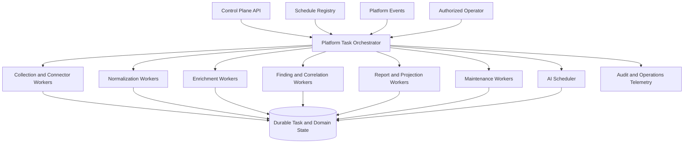
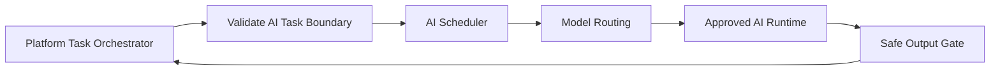

# Platform Task Orchestration Architecture

## Purpose

This document defines the future OpenAssetWatch architecture for scheduled, background, retryable, and long-running platform work.

The Platform Task Orchestrator coordinates non-interactive platform jobs such as connector polling, evidence normalization, enrichment refresh, finding recalculation, case correlation, report generation, projection retry, retention, and AI task submission.

It is intentionally separate from the AI Scheduler. The Platform Task Orchestrator manages the lifecycle of platform work. The AI Scheduler manages model- and agent-specific execution after an AI task has already passed platform authorization and policy checks.

This is a documentation-only design. It does not authorize unrestricted workflow scripting, arbitrary command execution, autonomous remediation, or self-expanding agent behavior.

## Architecture Status

- Architecture state: `documented_direction`
- Runtime impact: none
- Implementation authorization: none

---

## 1. Core Principles

1. Every task has an owner, purpose, scope, and expiration.
2. Durable task state is separate from transient queue state.
3. Repeated delivery must be idempotent.
4. Retries are bounded and classified by failure type.
5. Long-running work has leases, heartbeats, cancellation, and cleanup.
6. Tenant and resource scope are fixed before execution.
7. Tasks cannot widen their own permissions.
8. External dependencies use circuit breakers and health states.
9. Partial and degraded results are visible.
10. Platform work continues when AI is unavailable.
11. AI jobs are submitted through an explicit boundary rather than treated as ordinary opaque tasks.
12. The initial implementation may remain in-process until scale or isolation requires separate workers.

---

## 2. Relationship to the Platform Architecture



The Platform Task Orchestrator owns:

- task admission
- schedule resolution
- idempotency
- task state
- dependency ordering
- leases and heartbeats
- retries and circuit breakers
- cancellation
- tenant fairness
- worker selection
- task result persistence
- stale and orphan reconciliation

The AI Scheduler owns:

- AI compute-profile selection
- model and runtime eligibility
- AI-specific queues and concurrency
- token, latency, and cost budgets
- specialist-agent scheduling
- local versus self-hosted versus approved external routing
- AI execution health and fallback

---

## 3. Task Classes

### 3.1 Ingestion Tasks

Examples:

- process an endpoint inventory batch
- process passive sensor observations
- import an approved file
- receive and normalize a webhook batch
- replay source records from a checkpoint

### 3.2 Connector Tasks

Examples:

- poll an approved source
- validate a connector health state
- refresh a checkpoint
- retry a failed page
- reconcile connector drift

### 3.3 Normalization Tasks

Examples:

- canonicalize asset identity
- resolve aliases
- normalize software names and versions
- extract observables
- attach tenant and site scope
- preserve unmapped source fields

### 3.4 Enrichment Tasks

Examples:

- refresh vulnerability information
- refresh software lifecycle data
- update certificate or exposure metadata
- evaluate ownership confidence
- expire stale external knowledge

### 3.5 Finding and Correlation Tasks

Examples:

- run deterministic detection rules
- fuse duplicate findings
- recalculate confidence
- rebuild evidence bundles
- correlate alerts into cases
- recalculate exposure paths
- evaluate control-break recommendations

### 3.6 Case and Investigation Tasks

Examples:

- form a case
- generate a deterministic narrative
- refresh service targets
- assemble a shift handoff
- create a replay bundle
- close stale pending analysis jobs

### 3.7 Reporting and Projection Tasks

Examples:

- generate a report
- render a sanitized export
- create an external projection
- retry a failed projection
- reconcile inbound status

### 3.8 Maintenance Tasks

Examples:

- retention cleanup
- expired token cleanup
- stale evidence review
- artifact integrity check
- migration health check
- queue reconciliation
- orphan task cleanup
- coverage regression run

### 3.9 AI Submission Tasks

Examples:

- request evidence explanation
- request report drafting
- request relationship analysis
- request a detection draft
- request a bounded research enrichment

An AI submission task is not the AI execution itself. The Platform Task Orchestrator validates scope and submits an approved AI task envelope to the AI Scheduler.

---

## 4. Task Contract

Every task should use a versioned envelope.

```json
{
  "task_schema": "platform_task.v1",
  "task_id": "task-01J...",
  "task_type": "finding_recalculation",
  "tenant_id": "tenant-1",
  "site_id": "site-4",
  "requested_by": {
    "actor_type": "system",
    "actor_id": "schedule-finding-refresh"
  },
  "purpose": "Recalculate findings after evidence refresh",
  "resource_scope": {
    "asset_ids": ["asset-123"],
    "finding_ids": []
  },
  "idempotency_key": "finding-recalc:asset-123:evidence-digest",
  "priority": "normal",
  "scheduled_at": "",
  "not_before": "",
  "expires_at": "",
  "max_attempts": 3,
  "max_runtime_seconds": 120,
  "max_output_bytes": 262144,
  "required_capabilities": ["findings.recalculate"],
  "dependency_task_ids": [],
  "policy_version": "platform-policy-1",
  "input_refs": ["evidence-bundle-7"],
  "trace_id": "trace-01J..."
}
```

### Required Fields

- task identifier
- task schema version
- task type
- tenant
- authenticated requester or system owner
- purpose
- resource scope
- idempotency key
- priority
- schedule or trigger
- expiration
- maximum attempts
- maximum runtime
- output bound
- required capabilities
- dependency references
- policy version
- input references
- trace identifier

### Task Immutability

The authorized task envelope should be immutable after admission.

A change to:

- tenant
- resource scope
- task type
- capability set
- destination
- autonomy mode
- execution budget

requires a new task or an explicitly versioned replacement task.

---

## 5. Task States

Suggested states:

- `created`
- `validating`
- `authorized`
- `scheduled`
- `queued`
- `leased`
- `running`
- `waiting_for_dependency`
- `waiting_for_approval`
- `retry_scheduled`
- `partially_completed`
- `completed`
- `failed`
- `cancel_requested`
- `cancelled`
- `expired`
- `hard_timeout`
- `orphaned`
- `quarantined`

### State Rules

- `completed` requires validated output persistence.
- `partially_completed` must include coverage or omission details.
- `failed` must include a failure class and retry decision.
- `cancelled` must include cleanup status.
- `expired` tasks must not start.
- `orphaned` tasks require reconciliation before retry.
- task state transitions should be transactional.

---

## 6. Admission and Authorization

Before queueing, the orchestrator should validate:

- tenant and site scope
- actor identity
- task type
- policy version
- capability requirements
- resource ownership
- schedule ownership
- execution budget
- dependency validity
- destination policy
- idempotency key
- task expiration

A task must be rejected before queueing when:

- tenant scope is missing or ambiguous
- the requester lacks the required capability
- the task type is disabled
- the schedule is expired
- required evidence is unavailable
- the task would cross an unauthorized trust boundary
- the task attempts to use a prohibited action class

---

## 7. Idempotency and Duplicate Suppression

### 7.1 Purpose

Platform tasks may be delivered more than once because of retries, scheduler restarts, webhook duplication, queue redelivery, or operator actions.

### 7.2 Idempotency Key

The key should represent the logical operation rather than one queue message.

Examples:

- connector instance + source page + checkpoint
- asset + evidence digest + rule set version
- case + playbook + input digest
- report type + case version
- projection object + destination + canonical version

### 7.3 Required Behavior

When an equivalent task already exists:

- return the current task record when it is active
- return the completed result when reuse is safe
- create a replacement only when policy permits
- never run two conflicting mutations concurrently
- record duplicate suppression metrics

### 7.4 Result Reuse

A completed result may be reused only when:

- input digests match
- policy version remains valid
- output has not expired
- tenant scope matches
- the task type permits cached reuse
- no relevant dependency changed

---

## 8. Scheduling

### 8.1 Schedule Types

- one-time
- interval
- calendar-based
- event-triggered
- dependency-triggered
- manual
- recovery-triggered

### 8.2 Schedule Record

Suggested fields:

- schedule identifier
- owner
- tenant
- task template
- cadence
- start and expiration
- enabled state
- concurrency policy
- missed-run policy
- maximum backlog
- last scheduled time
- last completion time
- next run time
- health state

### 8.3 Missed-Run Policy

Possible policies:

- skip missed runs
- run once immediately
- replay each missed interval up to a cap
- require operator review

The policy should depend on task semantics. Retention cleanup may run once after downtime. Evidence polling may need checkpoint-based replay. Repeating every missed report generation may be unnecessary.

### 8.4 Schedule Ownership

Every recurring task requires:

- named owner
- purpose
- expiration or review date
- disablement path
- health signal
- failure escalation policy

---

## 9. Dependencies and Workflow Graphs

### 9.1 Dependency Model

A task may depend on:

- successful completion
- any terminal completion
- approved result
- specific output schema
- freshness threshold
- coverage threshold

### 9.2 Join Policies

Possible joins:

- all dependencies succeed
- any dependency succeeds
- quorum succeeds
- continue with partial result
- fail fast

The join policy should be explicit and deterministic.

### 9.3 Workflow Limits

A workflow should define:

- maximum nodes
- maximum depth
- maximum runtime
- maximum fan-out
- maximum retries
- cancellation propagation
- cycle prohibition
- result-size limits

### 9.4 No Arbitrary Scripting

Workflow conditions should use typed, reviewable expressions over approved fields. They should not permit unrestricted shell, dynamic code evaluation, or self-modifying workflow definitions.

---

## 10. Worker Model

### 10.1 Worker Registration

A worker should report:

- worker identifier
- version
- supported task types
- capability digest
- tenant eligibility
- maximum concurrency
- current load
- health
- last heartbeat
- isolation profile

### 10.2 Worker Pools

Possible pools:

- ingestion
- connector
- normalization
- intelligence
- reporting
- maintenance
- AI submission

The initial implementation may use one process with typed pools. Separate workers should be introduced only when isolation, scale, ownership, or reliability requires them.

### 10.3 Worker Selection

Selection should consider:

- task type
- tenant eligibility
- required capabilities
- data locality
- isolation requirement
- current load
- worker health
- affinity or anti-affinity

### 10.4 Worker Trust

Workers must not receive:

- unrelated tenant data
- unrestricted database credentials
- broader tool access than required
- reusable external credentials when a brokered route is available
- permission to alter their task envelope

---

## 11. Leases, Heartbeats, and Orphan Recovery

### 11.1 Lease

A lease grants one worker temporary ownership of a task.

Suggested fields:

- task identifier
- worker identifier
- lease token hash
- leased at
- expires at
- heartbeat interval
- last heartbeat
- attempt number

### 11.2 Heartbeats

Heartbeats should include:

- task state
- progress summary
- budget use
- last successful checkpoint
- cancellation acknowledgement

### 11.3 Lease Expiration

When a lease expires:

1. mark the task as potentially orphaned
2. verify worker health
3. inspect last checkpoint
4. release or quarantine external resources
5. decide whether retry is safe
6. create a new attempt only after reconciliation

### 11.4 Orphan-Safe Tasks

Tasks should define whether they are:

- safe to retry from start
- safe to resume from checkpoint
- safe only after reconciliation
- not automatically retryable

---

## 12. Retry and Failure Classification

### 12.1 Failure Classes

- transient dependency failure
- rate limited
- authentication failure
- authorization denial
- invalid input
- schema drift
- dependency unavailable
- timeout
- resource exhaustion
- policy denial
- cancelled
- unsafe state
- internal error

### 12.2 Retry Rules

- transient failures may retry with bounded backoff
- rate limits should honor a retry time where available
- authentication failures open a connector or integration circuit
- authorization and policy denials do not retry automatically
- invalid input moves to a rejected or quarantined state
- schema drift requires review or adapter update
- resource exhaustion may retry with lower concurrency only when policy permits
- unsafe state blocks retry until reconciliation

### 12.3 Backoff

Backoff should include:

- base delay
- maximum delay
- jitter
- attempt cap
- task expiration
- per-tenant and global retry budgets

---

## 13. Circuit Breakers

Circuit breakers should isolate failing dependencies.

Suggested states:

- `closed`
- `open`
- `half_open`

A circuit record should include:

- dependency identifier
- tenant scope where applicable
- failure count
- last failure class
- opened at
- cooldown
- next probe time
- last successful time

Opening one connector or external dependency circuit must not block unrelated platform work.

---

## 14. Cancellation

### 14.1 Cancellation Sources

- operator request
- parent workflow cancellation
- tenant kill switch
- component kill switch
- schedule disablement
- policy revocation
- hard timeout
- system shutdown

### 14.2 Cancellation Contract

Cancellation should:

- set `cancel_requested`
- stop new child work
- propagate to dependencies where policy allows
- notify the active worker
- terminate external operations where supported
- preserve partial results
- perform cleanup
- record final cancellation status

### 14.3 Non-Cooperative Work

The platform must not depend on a model or tool voluntarily stopping. Process, task, network, and credential boundaries should support deterministic termination.

---

## 15. Checkpoints and Resumability

A checkpoint may contain:

- task identifier
- attempt
- stage
- source cursor
- processed item count
- remaining item estimate
- input digest
- partial result reference
- checkpoint digest
- created time

Checkpoint rules:

- checkpoints are schema-versioned
- secrets are excluded
- checkpoint size is bounded
- a resumed task validates input and policy compatibility
- stale checkpoints expire
- a checkpoint does not imply successful completion

---

## 16. Resource Budgets

Tasks should support:

- maximum runtime
- maximum CPU or worker time
- maximum memory class
- maximum records
- maximum pages
- maximum output bytes
- maximum external calls
- maximum retries
- maximum child tasks
- maximum AI token and cost budget where applicable

Budget exhaustion should produce a visible partial or failed state with the limit that was reached.

---

## 17. Tenant Fairness and Priority

### 17.1 Priorities

Suggested priorities:

- emergency platform control
- critical security operation
- high operator task
- normal interactive support
- background
- maintenance

### 17.2 Fairness Controls

- per-tenant concurrency
- per-task-type concurrency
- global concurrency
- queue aging
- retry budget
- background-work throttling
- emergency reserve

One tenant or connector should not starve the rest of the platform.

### 17.3 Priority Limits

A user or agent should not be able to mark ordinary work as emergency without the required authorization.

---

## 18. AI Scheduler Boundary

### 18.1 Submission Flow



### 18.2 AI Task Boundary Validation

Before submission, validate:

- task class
- tenant
- evidence scope
- trust labels
- model eligibility
- external processing policy
- tool eligibility
- output destination
- AI budget
- human approval requirement

### 18.3 Return Contract

The AI Scheduler should return:

- AI execution identifier
- status
- model profile
- evidence references
- structured result
- validation state
- resource use
- uncertainty
- failure or fallback reason

The Platform Task Orchestrator should not interpret hidden model reasoning. It should consume only validated structured outputs and execution metadata.

---

## 19. Durable State Versus Queue State

### Durable State

Store durably:

- task envelope
- current state
- attempts
- schedule ownership
- idempotency key
- checkpoints
- result references
- failure classification
- approvals
- audit events

### Transient State

May remain transient:

- queue delivery token
- short-lived worker reservation
- temporary progress pulse
- cache entry
- transport retry metadata

The queue may be rebuilt from durable state where practical.

---

## 20. Audit and Observability

### Audit Events

- task created
- task authorized or denied
- task scheduled
- task leased
- task started
- checkpoint written
- dependency satisfied or failed
- retry scheduled
- circuit opened or closed
- approval requested or decided
- cancellation requested
- task completed, partial, failed, or expired

### Metrics

- queue depth by task type
- oldest queued task
- task duration
- success and failure rate
- retries
- duplicate suppression
- lease expiration
- orphan count
- cancellation latency
- per-tenant concurrency
- circuit state
- output truncation
- budget exhaustion
- AI submission and validation rate

### Logging

Logs should include identifiers and state changes, not raw secrets, unrestricted evidence, model prompts, or sensitive payloads.

---

## 21. Shutdown and Upgrade Behavior

During shutdown or upgrade:

- stop admitting new work
- stop issuing new leases
- request cancellation or checkpoint for long-running tasks
- allow bounded graceful completion
- release leases
- persist queue and schedule state
- reconcile running tasks on startup

An application upgrade should not convert unknown in-flight work into completed status.

---

## 22. Security Requirements

- task admission is authenticated
- tenant scope is mandatory
- task envelopes are immutable after authorization
- child tasks cannot exceed the parent policy ceiling
- workers use least-privilege identities
- credentials are brokered or narrowly scoped
- external destinations are allowlisted
- task results are schema-validated
- queues do not become untrusted command channels
- cancellation does not depend on model cooperation
- durable state is protected from worker tampering
- audit records are written outside task-controlled output paths
- workflow conditions do not allow arbitrary code execution

---

## 23. Implementation Roadmap

### Phase A — Durable Task Contract

- define task, attempt, schedule, checkpoint, and result schemas
- add idempotency keys
- add state-transition validation
- add audit events

### Phase B — In-Process Orchestrator

- centralize existing scheduled work
- add typed worker functions
- add bounded retries
- add cancellation and timeouts
- add task operations views

### Phase C — Connector and Maintenance Work

- move connector polling behind task records
- add circuit breakers
- add retention and stale-evidence jobs
- add projection retry

### Phase D — Finding and Case Work

- add finding recalculation tasks
- add correlation jobs
- add report generation
- add workflow dependencies

### Phase E — Queue-Backed Workers

- add a durable queue when load requires it
- separate worker pools
- add leases and heartbeats
- add orphan reconciliation

### Phase F — AI Boundary

- submit approved AI task envelopes
- correlate platform and AI execution IDs
- enforce independent AI budgets
- validate returned artifacts through the Safe Output Gate

---

## 24. Acceptance Criteria

The first production-capable orchestrator should not be considered complete until:

- every task has tenant, owner, purpose, scope, and expiration
- repeated delivery does not create duplicate effects
- state transitions are transactional
- active work has leases and heartbeats
- stale leases are reconciled
- retries are bounded and failure-class aware
- connector failures are isolated by circuit breakers
- cancellation works without tool or model cooperation
- task results are validated before completion
- queue loss does not erase durable task state
- per-tenant fairness prevents starvation
- Platform Task and AI Scheduler responsibilities remain separate
- partial and degraded outcomes are visible
- all important task events are auditable

---

## 25. Explicit Non-Goals

This architecture does not authorize:

- arbitrary shell jobs
- user-supplied executable workflow code
- unrestricted network automation
- autonomous containment or remediation
- self-modifying task permissions
- agents creating their own schedules without authorization
- infinite retries
- unbounded fan-out
- queue messages as authoritative state
- AI scheduling ordinary platform maintenance
- platform workers bypassing AI policy

## Final Position

OpenAssetWatch needs one durable execution foundation for background platform work, but it does not need to begin as a large distributed workflow system.

The correct progression is to define strong task contracts first, centralize existing work behind those contracts, and add queues or separate workers only when justified. Keeping the Platform Task Orchestrator separate from the AI Scheduler preserves clear ownership, safer failure behavior, and continued operation when AI is disabled.